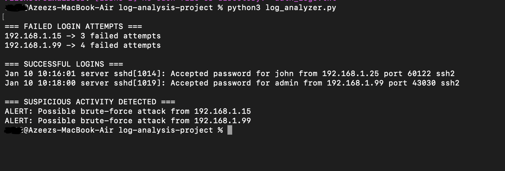
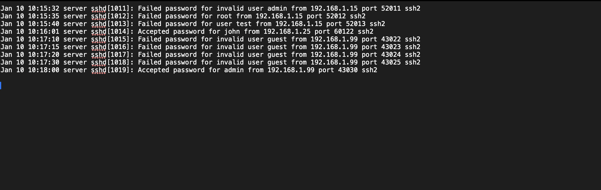
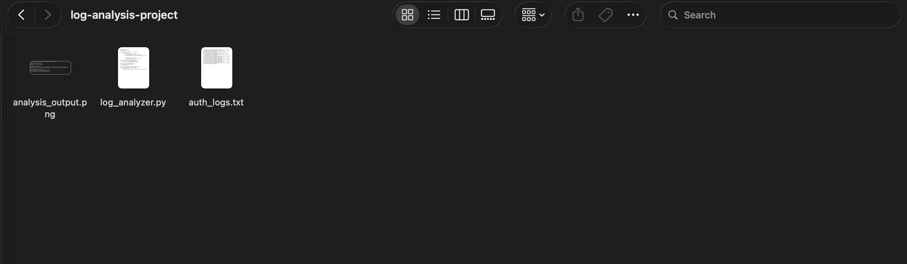

# log-analysis-threat-detection
SOC-style authentication log analysis and brute-force detection using Python
# Log Analysis & Threat Detection Project

This project demonstrates SOC-style authentication log analysis using Python to detect suspicious login behaviour.

## Tools Used

- Python  
- macOS Terminal  

## Project Objectives

- Detect failed login attempts  
- Identify suspicious IP activity  
- Flag brute-force behaviour  
- Produce security analysis report  

## Screenshots

### Detection Output

### Log File

### Project Files

## Skills Demonstrated

- Log analysis  
- Threat detection  
- Security automation  
- Python scripting  
